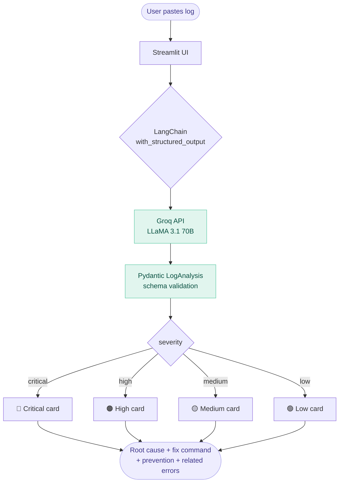

# DevOps Log Analyser

> Paste Jenkins, Kubernetes, or Docker logs — get instant root cause, exact fix command, and prevention advice. Powered by LangChain + Groq LLaMA 3.1 70B + Pydantic structured output.


---

## What it does

| Input | Output |
|-------|--------|
| Raw Jenkins build log | Severity · root cause · fix command |
| Kubernetes pod error | Affected component · prevention advice |
| Docker build failure | Related errors · structured JSON |
| GitHub Actions failure | Instant triage — no manual log reading |

---

## Architecture



---

## Key technical decisions

### Pydantic structured output — not prompt-based JSON
Most tutorials ask the LLM to "return JSON" in the prompt — fragile, breaks on edge cases. This project uses `llm.with_structured_output(Issue)` which enforces the schema at the API level via function calling. The frontend never gets a parsing error.

```python
class Issue(BaseModel):
    severity: str        # "critical" | "high" | "medium" | "low"
    log_type: str        # "Jenkins" | "Kubernetes" | "Docker"
    affected_component: str
    root_cause: str
    immediate_action: str  # exact command
    prevention: str
    related_errors: List[str]

structured_llm = llm.with_structured_output(Issue)
result = structured_llm.invoke(f"Analyse this log:\n\n{log_text}")
# result is always a valid Issue object — no try/except needed
```

### LangChain LCEL — composable and streaming-ready
```python
chain = prompt | llm | StrOutputParser()
# streaming works automatically — no extra code
for chunk in chain.stream({"log": log_text}):
    print(chunk, end="")
```

### Groq — free, fast, no Azure portal needed
Groq's free tier gives 30 requests/minute on LLaMA 3.1 70B. No credit card, no cloud account, no VNet setup. Identical API shape to OpenAI — swap to Azure OpenAI in production by changing one import and one env variable.

---

## Demo — sample logs included

The app ships with 4 built-in sample logs you can test immediately:

| Sample | Error type |
|--------|-----------|
| Kubernetes – ImagePullBackOff | ACR 401 Unauthorized |
| Jenkins – Stage failure | Namespace not found |
| Kubernetes – CrashLoopBackOff | Python executable not in PATH |
| Docker – Build failure | Package version not found |

---

## Setup

### 1. Clone and create virtual environment
```bash
git clone https://github.com/your-username/devops-log-analyser
cd devops-log-analyser
python -m venv venv
source venv/bin/activate      # Windows: venv\Scripts\activate
```

### 2. Install dependencies
```bash
pip install -r requirements.txt
```

### 3. Get a free Groq API key
1. Go to [console.groq.com](https://console.groq.com)
2. Sign up (no credit card needed)
3. Create an API key

### 4. Add your key
```bash
# create the secrets file
mkdir .streamlit
echo 'GROQ_API_KEY = "gsk_your_key_here"' > .streamlit/secrets.toml
```

### 5. Run
```bash
streamlit run app.py
# opens at http://localhost:8501
```

---

## Project structure

```
devops-log-analyser/
├── app.py                  # entire application (~120 lines)
├── requirements.txt        # 4 dependencies
├── .gitignore              # secrets.toml excluded
├── .streamlit/
│   └── secrets.toml        # your API key (gitignored)
└── README.md
```

---

## How this maps to production Azure OpenAI

This project uses Groq for portability (no cloud account needed). In a production Azure deployment, swap one line:

```python
# Development (this project)
from langchain_groq import ChatGroq
llm = ChatGroq(model="llama-3.1-70b-versatile", api_key=...)

# Production (Azure OpenAI)
from langchain_openai import AzureChatOpenAI
llm = AzureChatOpenAI(azure_deployment="gpt-4", azure_endpoint=...)
```

Everything else — Pydantic model, structured output, Streamlit UI — stays identical. The abstraction layer is the point.

---

## Extending this project

- **Auto-create Jira tickets** — add a `requests.post()` call to the Jira REST API when severity is `critical`
- **Slack alerts** — post the structured result to a Slack webhook on critical/high findings
- **Jenkins webhook** — replace the text area with a POST endpoint that receives logs directly from Jenkins `post { failure { ... } }` block
- **Batch mode** — add a file uploader to process multiple log files at once
- **History** — store past analyses in SQLite and add a search page

---

## Skills demonstrated

| Skill | Where used |
|-------|-----------|
| LangChain structured output | `llm.with_structured_output(Issue)` |
| Pydantic schema design | `Issue` model with 7 typed fields |
| Prompt engineering | Zero-shot system prompt for log classification |
| Python async patterns | `@st.cache_resource` for LLM singleton |
| Responsible AI | Severity classification prevents alert fatigue |
| DevOps domain knowledge | 4 real error patterns from Jenkins + Kubernetes |

---

## Author

Built by **Shreyasi** · DevOps + AI Engineer  
[LinkedIn](https://linkedin.com/in/your-profile) · [GitHub](https://github.com/your-username)

---

## License

MIT — free to use, modify, and share.
